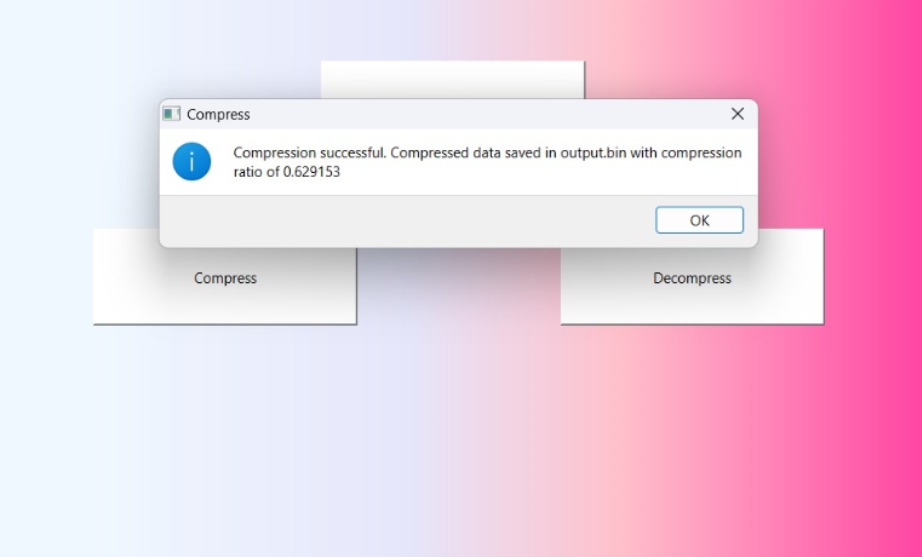
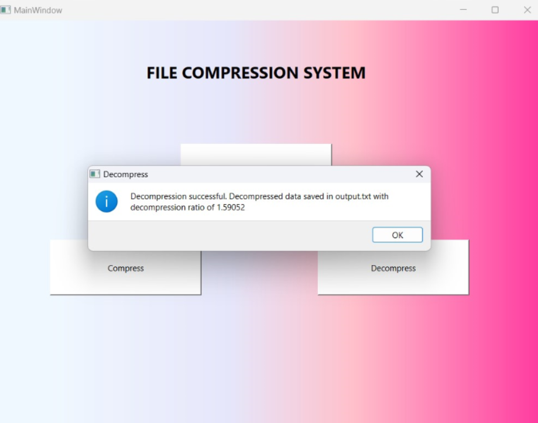
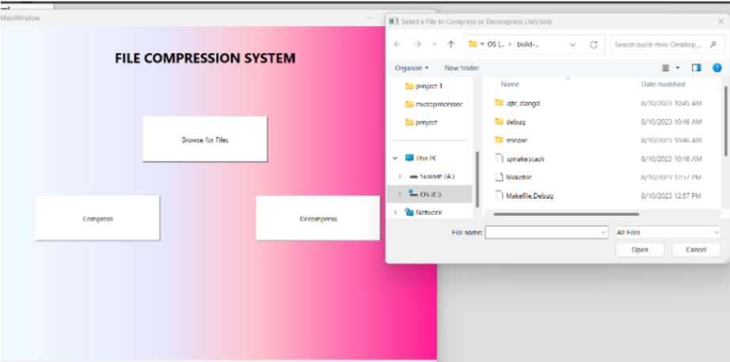
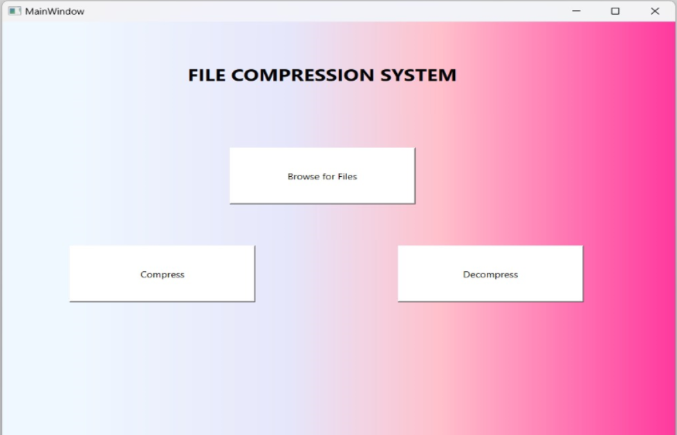

# File Compression System

## Overview

This project is a **File Compression System** that allows users to compress and decompress files using Huffman Encoding. The application provides a graphical user interface (GUI) built with **Qt** and displays compression and decompression ratios.

## Features

- **File Compression**: Compresses input text files to reduce storage size.
- **File Decompression**: Recovers the original file from the compressed format.
- **GUI Interface**: User-friendly graphical interface for easy interaction.
- **Compression Ratio Display**: Shows the efficiency of compression.

## Technologies Used

- **Programming Language**: C++
- **GUI Framework**: Qt 
- **Compression Algorithm**: Huffman Encoding

## Installation

### Prerequisites

Ensure you have the required dependencies installed:

#### For C++ (Qt Framework):

Ensure you have **Qt Creator** or **Qt Libraries** installed.

## Running the Project

#### C++ Version:

Open the project in **Qt Creator** and build/run the application.

## Usage

1. Open the application.
2. Click **"Compress"** to select a file and compress it.
3. Click **"Decompress"** to restore the compressed file.
4. View compression/decompression ratio in the pop-up message.

## Future Enhancements

- Support for additional compression algorithms.
- Batch file compression.
- Improved UI design.

## Images

## Author

Developed by **[Praju]**.

